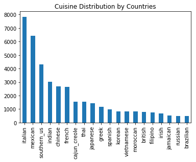
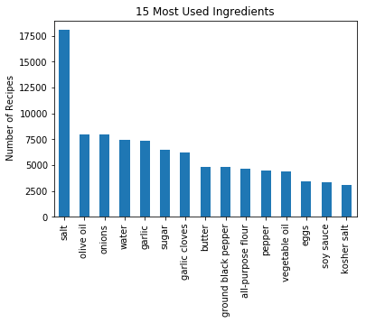
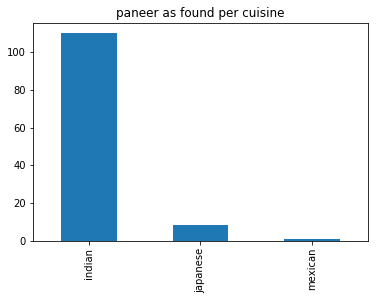
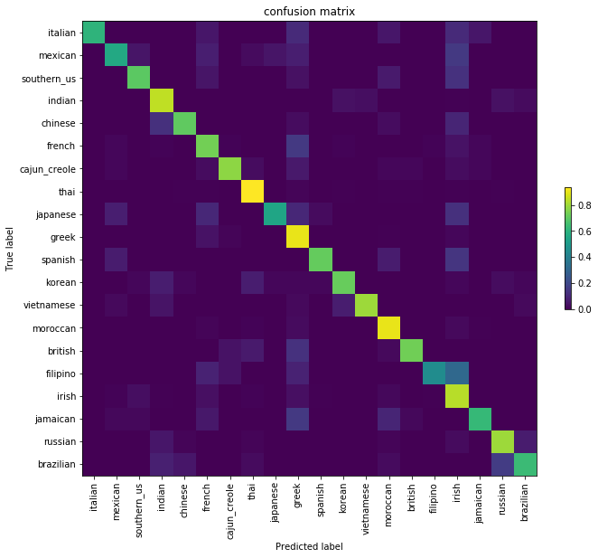
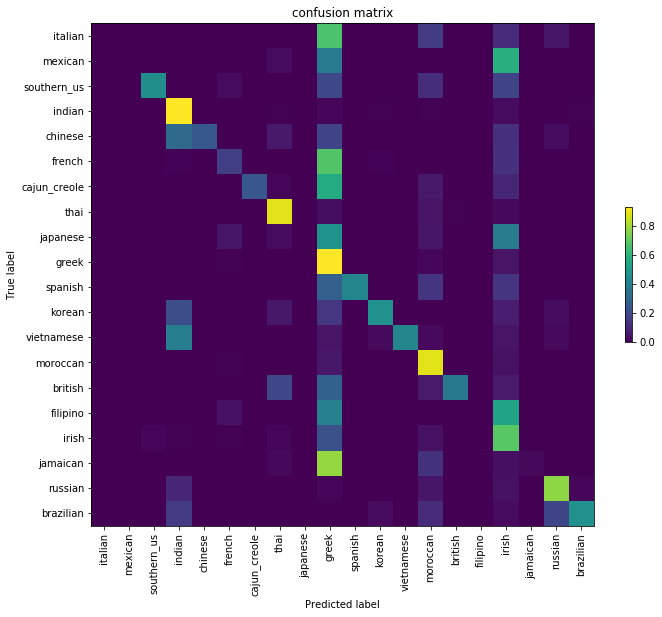

# Where is the Chef From ? - Kaggle Challenge
### https://www.kaggle.com/c/whats-cooking-kernels-only/overview
In this project I aim to predict the category of a dish's cuisine given a list of its ingredients.   
Complete documented code is in <code>chef.ipynb</code>. 
### From the official desc:- 
‘’If you're in Northern California, you'll be walking past the inevitable bushels of leafy greens, spiked with dark purple kale and the bright pinks and yellows of chard. Across the world in South Korea, mounds of bright red kimchi greet you, while the smell of the sea draws your attention to squids squirming nearby. India’s market is perhaps the most colorful, awash in the rich hues and aromas of dozens of spices: turmeric, star anise, poppy seeds, and garam masala as far as the eye can see. Some of our strongest geographic and cultural associations are tied to a region's local foods.’’

The public dataset is from the Kaggle competition, What’s for Dinner?The data is provided in JSON format. Each example in the dataset contains the recipe identification, type of cuisine and a list of ingredients. There are an average of 11 ingredients per recipe. The data consists of 39,774 unique recipes from 20 countries with 428,275 ingredients (6,714 unique).

### Feature Engineering
Figure 1

Figure 2

Figure 3

Several feature engineering challenges emerge from the fact that some of the ingredients are commonly used across multiple cuisines (for example, salt, oil and water). Figure 2 shows the top 15 ingredients found in the dataset across all cuisines. Figure 1 shows the distribution of recipes across various cuisines. The distribution is uneven; some countries are represented in higher volume compared to others. 
Figure 3 demonstrates the use of a particular ingredient (paneer) across various cuisines. This example shows a strong connection between a small set of countries and an ingredient.
A high level analysis of the data reveals the necessity of data cleansing. The following list includes some examples of data clean up that we will address in
subsequent sections:
1. Misspelled ingredient names.
2. Singular vs plural (i.e. eggs vs egg).
3. Preparatory step included in the ingredient
name (i.e. diced tomatoes vs chopped
tomatoes).

### Initial Design 
Binary Encoding is ued to extract the ingredients as individual elements and to map the ingredients to dictionaries. The
matrix consists of zeros and ones to indicate if an ingredient exists in the recipe. In this design matrix n = 6700 (or the number of unique ingredients).

Secondly, a corresponding (m, 1) matrix with values ranging from 0-19 to represent the country of origin for each recipe in the dataset was created.  Lastly, I split the data into 37,785 examples for training and
1,989 examples for test - this is a roughly 95% by 5% split.

## Process
I trained the training set on five multi-class classification algorithms, optimized the model
hyperparameters for some of the potential winners by Grid Search, performed cross validation check on the tuned models and then made predictions on the test data set. Subsequently, the model's performance was analysed through multiple evaluation matrices (Cross Validation Score, Testing Score and Confusion Matrix). 

After analyzing the errors, the necessary adjustments to previous processes and
structures were made.
### Algorithm's Used:-
1. [Support Vector Machine](https://scikit-learn.org/stable/modules/svm.html)
2. [Logistic Regression](https://scikit-learn.org/stable/modules/generated/sklearn.linear_model.LogisticRegression.html)
3. [Simple Neural Network](https://scikit-learn.org/stable/modules/generated/sklearn.neural_network.MLPClassifier.html0)
4. [Decision Tress Classifier](https://scikit-learn.org/stable/modules/generated/sklearn.tree.DecisionTreeClassifier.html#sklearn.tree.DecisionTreeClassifier)
5. [Random Forests](https://scikit-learn.org/stable/modules/generated/sklearn.ensemble.RandomForestClassifier.html)
### Initial Experiment
Initially, I implemented a simple one layer (vanilla) neural network  to output a baseline model and understand the data. To train this model I used Binary Encoding to create the design matrix  The training accuracy of the NN was approximately
97% and the test accuracy was roughly 78%. The model overfitted the training data. initial error analysis revealed:
1. Data cleanup opportunity. In particular, remove extra words that do not add value to learning
from ingredients. These extra words erroneously make non-unique ingredients appear distinct.
2. Tune the NN and address the high variance.
3. Apply additional multiclass classification algorithms for comparison.
4. Rethink about Binary Encoding. Also, would like to reduce the number of features so that it will be more efficient for algorithms like SVM.
### Changing the Design Matrix
TF-IDF vectorizer was now used to extract a bag of words from the recipe data by setting stop_words to ‘english’ and binary to True. Second, derived the (m, n) TF-IDF design matrix which returns a normalized count of ingredients based on how many times an ingredient appears across all recipes.Having an indication of the frequency of a certain ingredients would provide additional information as opposed to simply Binary Encoding, hence TF-IDF.

### Results
| Algorithm | Accuracy on Test Data |
| --- | --- |
| `Logistic Regression` | **81%** | 
| `Decision Trees` | **65.35%** |
| `Random Forest` | **66.01%** |
| `Support Vector Machines` | **82.05%** |
| `Simple Neural Network` | **79.43%** |

### Confusion Matrix
CM Of SVM (best)             | CM of Random Forests (worst)
| :-------------------------:|:--------------------: |
|   |   | 
I evaluated the classification accuracy by computing the confusion matrix. Each row corresponds to the true cuisine label.The results were normalized by dividing by the number of recipes for each cuisine in
the test data. The diagonal elements represent the proportion of samples for each cuisine whose predicted label was equal to the true label, while off-diagonal elements were mislabeled by the classifier. In other words, the higher the diagonal values of the confusion matrix the better since this indicates a greater number of correct predictions.
 
One of the key observations was the similarity in accuracy scores between training
performance and test performance. This **indicates low variance.** In simpler words, 
***model was not overfitting.*** This  lead to our questioning ways to further reduce the bias by :-
1. Extending feature vectors.
2. Hyperparameter optimization.
We extended our feature vector considerably through collecting additional player statistics as mentioned in the feature engineering section. We also applied grid search over various hyper parameters on several
of our models.

Phew... That's one long <code>README.MD</code>
### References
1. Multiclass classification. https://en.wikipedia.org/wiki/Multiclass_classification
2. Mohamed, Aly (2005). "Survey on multiclass classification methods" (PDF). Technical Report,
Caltech.
3. Kaggle dataset: https://www.kaggle.com/kaggle/recipe-ingredients-dataset/home
4. ManishPandit
5. ScikitLearn Docs. (srsly, wth could be possible without it ? )